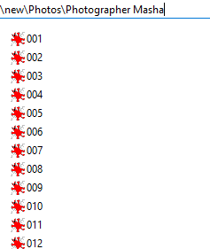
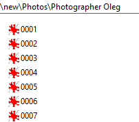
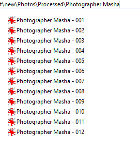
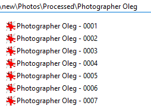

# PicturesApp

### A simple utility for mass renaming and copying image files.

When I work with image files, I sometimes get a situation like this:

Multiple folders having image files with generic and not easily identifiable names. This is not convenient for me - I would like their names to be distinct, like this:

This application does exactly that.

The algorithm is pretty simple: it goes through the subdirectories of specified folders recursively and copies every .png or .jpg file to the "Processed" folder, also renaming image files to reflect their original folder name.
If new image name is too long, it will be trimmed.

### How to use:

You can drag'n'drop a folder on picturesapp.exe, or use the App.config file to specify settings.
